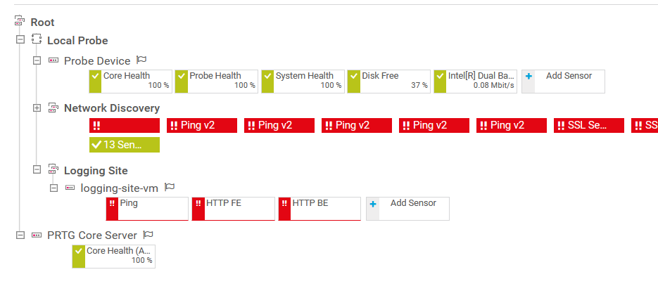

<h1 align="center">Tìm hiểu về PRTG Network Monitor</h1>

Giải pháp monitor dịch vụ và hệ thống.

PRTG sử dụng các sensor để monitor hệ thống, mỗi sensor sẽ monitor một thành phần hoặc yếu tố. Ví dụ, để monitor một server, sẽ cần nhiều sensor cho mỗi yếu tố cần giám sát. 1 cho CPU load, 1 cho RAM, 1 cho dung lượng storage...

PRTG monitor được cấu thành từ 3 thành phần: giao diện web, PRTG core server probe.

- Giao diện web là nơi người dùng sẽ tương tác và giám sát hoạt động của PRTG. Giao diện hiển thị các thông số nhận được từ sensor, nhận yêu cầu và setting, config từ người dùng.

- Core server là bộ não của PRTG, kiểm soát và xử lý config, dữ liệu, thông báo và giao diện.

    - Thực hiện nhận, lưu trữ và xử lý dữ liệu từ probe, gửi thông báo tới người dùng nếu cần cũng như cung cấp và cập nhật trên Web UI.

- Probe có thể hiểu như là tay mắt của PRTG, là thành phần thực hiện thu thập dữ liệu từ thiết bị và sensor.

    - Probe chạy sensor, thu thập dữ liệu, gửi dữ liệu về core server.

    - Có hai loại probe là local probe và remote probe. Local probe chạy trên chính máy đang chạy PRTG server và thực hiện monitor các thiết bị trong network local. Remote probe là probe được cài đặt trên một hệ thống khác và kết nối trở về core server, cho phép PRTG monitor các địa điểm từ xa mà không cần phải config firewall phức t
PRTG sắp xếp đối tượng được giám sát theo thứ tự: Root -> Probe -> Group -> Device -> Sensor

Ví dụ:

- Local Probe là probe đang chạy trên máy host, trong đó có chứa các group và device nhỏ hơn.

    - Probe Device chỉ máy tính đang chạy PRTG server. Các sensor của device này dùng để monitor các thông số của hệ thống và probe như sức khỏe, disk, card mạng...

    - Network Discovery chỉ các thiết bị cùng network với host. Trong group này có phân ra các group nhỏ hơn theo loại như thiết bị network, hệ điều hành, máy in, máy ảo...

    - Logging Site ở đây là một group do người dùng tạo để đo đạc hoạt động của một trang web, cả backend lẫn frontend.

PRTG có thể monitor:

- Network:

    - Router, switch.
    - Bandwidth usage, phân tích traffic.

- Server:

    - Giám sát hoạt động phần cứng của server thông qua SSH.
    - Application server như Apache hay Nginx.

- Database: giám sát kết nối và thời gian query, thời gian phản hổi.

- Trang web và API:

    - Check uptime của trang web thông qua ping và HTTP/HTTPS
    - Giám sát uptime, response time và khối lượng dữ liệu của các API.

- Dịch vụ cloud.
- Container như Docker hay các máy ảo.

PRTG có cung cấp REST API để thực hiện trao đổi thông tin với các dịch vụ khác.

Note: PRTG server và probe chỉ hỗ trợ cài đặt trên hệ điều hành Windows.