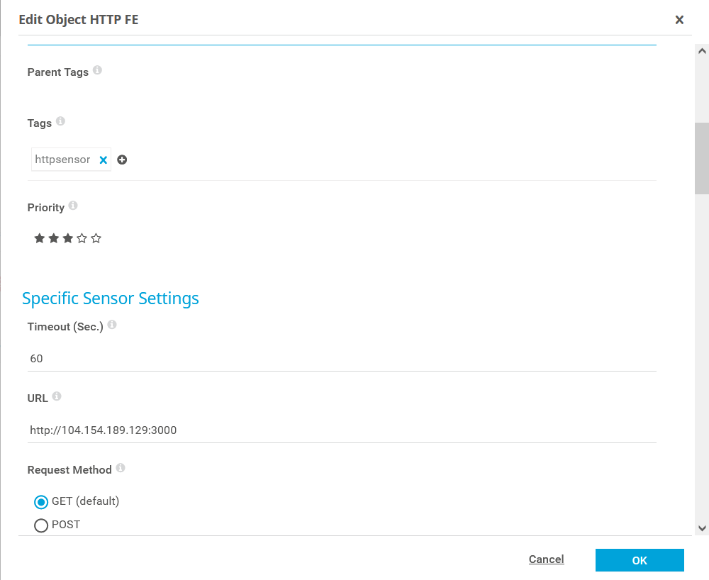
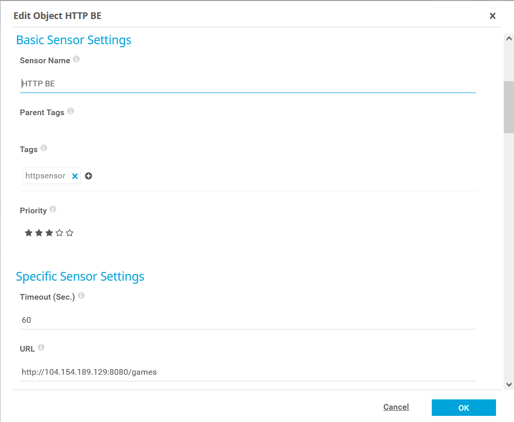
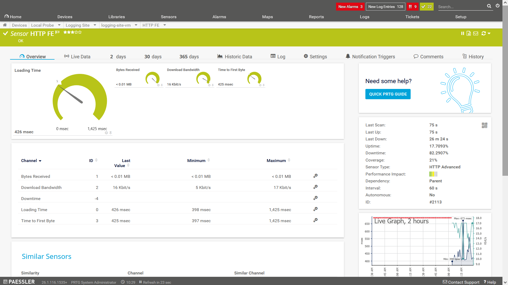
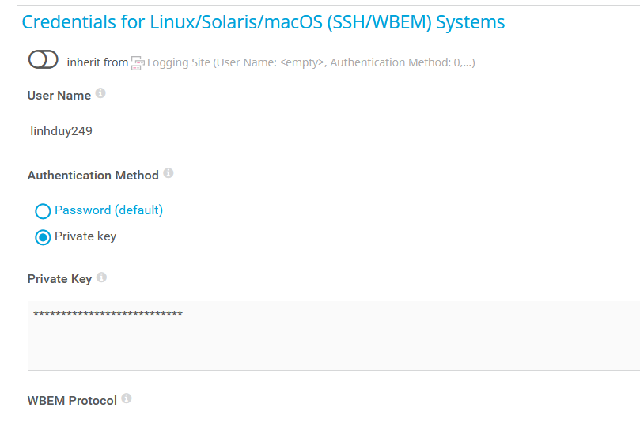
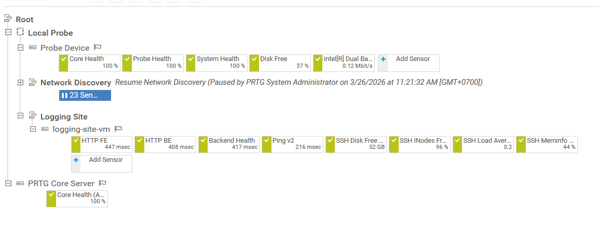
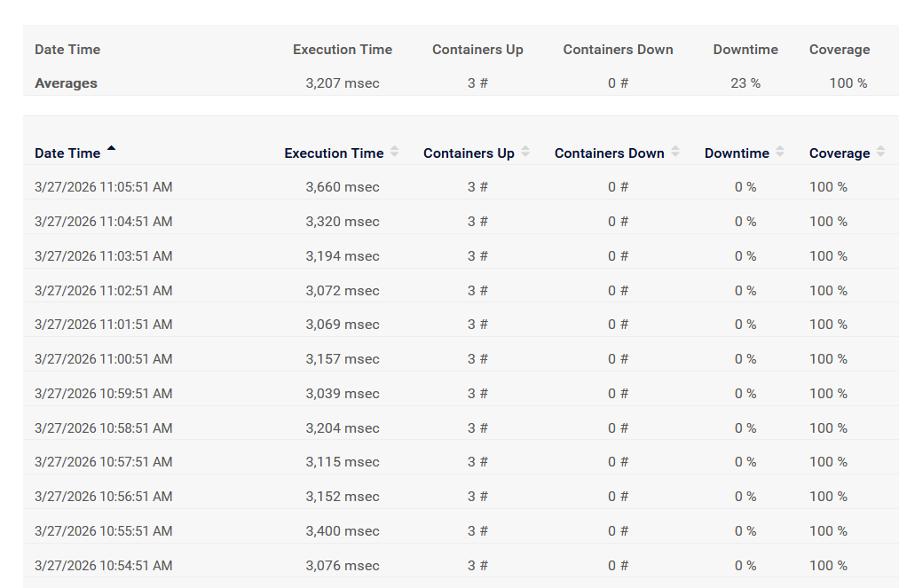

PRTG web UI chạy trên địa chỉ loopback 127.0.0.1

Để thực hiện monitor một website (frontend và backend): trong tab device trong giao diện PRTG, chọn add group và add device để tạo một device mới, sau đó thực hiện thêm các sensor.

Cơ bản thì sẽ cần hai sensor để monitor frontend và backend. Chọn add sensor, chọn HTTP advanced sensor và nhập URL của frontend và backend vào.

Frontend



Backend



Có thể sử dụng địa chỉ IP public hoặc domain.

Ví dụ dashboard của một sensor



Ngoài các thông tin này ra, PRTG còn cung cấp biểu đồ report hoạt động trong khoảng thời gian 2 ngày, 30 ngày và 365 ngày.

Note: nếu sử dụng backend Spring Boot, có thể thêm một sensor để track sức khỏe của backend thông qua API /actuator/health nếu backend sử dụng dependency actuator:

```
<dependency>
<groupId>org.springframework.boot</groupId>
<artifactId>spring-boot-starter-actuator</artifactId>
</dependency>
```

Thêm config sau vào application.properties:

```
management.endpoints.web.exposure.include=health,info
management.endpoint.health.show-details=when_authorized
```

Khi gọi API /actuator/health, backend sẽ trả về status hoạt động của nó.

**Monitor hệ thống linux thông qua SSH**

PRTG có thể monitor hệ thống chạy hệ điều hành Linux thông qua SSH. Để thực hiện, cần vào setting của device hiện tại trong PRTG và thay đổi setting Linux:



Nhập tên user muốn sử dụng trong hệ thống Linux vào và nhập private key (nếu sử dụng SSH key làm phương thức login)

- Chạy ssh-keygen để tạo key SSH. VD: ssh-keygen -t ed25519 -C "linhduy249". Key sẽ được chứa trong thư mục .ssh, key public trong file có đuôi pub, key private sẽ nằm trong file còn lại.

- Nên chọn cùng user với user sử dụng thường xuyên trên hệ thống linux để dễ dàng thao tác.

Sau khi setup thành công, có thể thực hiện auto discovery để setup một số sensor cơ bản.



Qua SSH, PRTG có thể monitor lượng disk free, lượng inodes còn dư, load average và dung lượng RAM free.

**SSH script sensor**

Script sensor kết nối với hệ thống thông qua SSH để chạy script chứa trong hệ thống đang monitor. Dùng để monitor các tác vụ cụ thể hơn hoặc thực hiện script định kỳ.

VD: Sử dụng script để kiểm tra trạng thái docker container của logging site.

Note:

- Sensor này tiêu tốn nhiều tài nguyên, khuyến cáo không sử dụng nhiều.

- Script cần được chứa trong thư mục /var/prtg/scriptsxml và cần cấp quyền execute. VD: sudo chmod +x /var/prtg/scriptsxml/check_logging_site_containers.sh

- Output của script cần phải ở dạng XML hoặc JSON để PRTG có thể format được data.

Script sử dụng để track container chạy logging site:

```
#!/usr/bin/env bash
set -u

EXPECTED=("logging-site-frontend-1" "logging-site-backend-1" "logging-site-db-1")

# Collect currently running container names
running="$(docker ps --format '{{.Names}}' 2>/dev/null || true)"

down=0
missing_list=()

for c in "${EXPECTED[@]}"; do
  if ! grep -Fxq "$c" <<< "$running"; then
    down=$((down+1))
    missing_list+=("$c")
  fi
done

up=$(( ${#EXPECTED[@]} - down ))

if [ "$down" -eq 0 ]; then
  status_text="OK: all containers running"
else
  status_text="DOWN: ${missing_list[*]}"
fi

# PRTG SSH Script Advanced expects strict XML/JSON output.
# Output XML only (no extra text).
cat <<EOF
<prtg>
  <result>
    <channel>Containers Up</channel>
    <value>${up}</value>
    <unit>Count</unit>
  </result>
  <result>
    <channel>Containers Down</channel>
    <value>${down}</value>
    <unit>Count</unit>
    <LimitMode>1</LimitMode>
    <LimitMaxError>0</LimitMaxError>
  </result>
  <text>${status_text}</text>
</prtg>
EOF
```

Script kiểm tra xem 3 container frontend, backend và db có đang chạy hay không và trả về kết quả dưới dạng XML.

Sau khi setup thành công, sensor sẽ monitor thời gian thực hiện script và số lượng container đang chạy và không chạy như sau:



