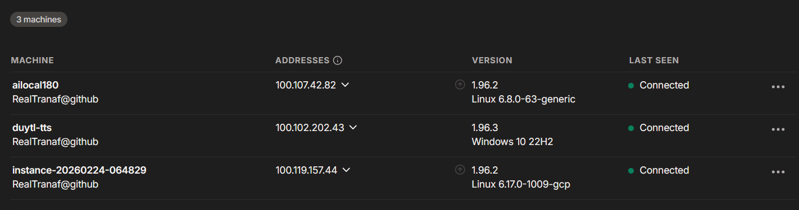
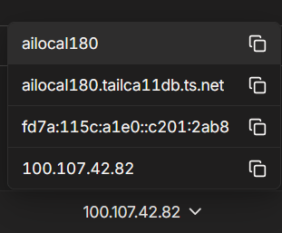
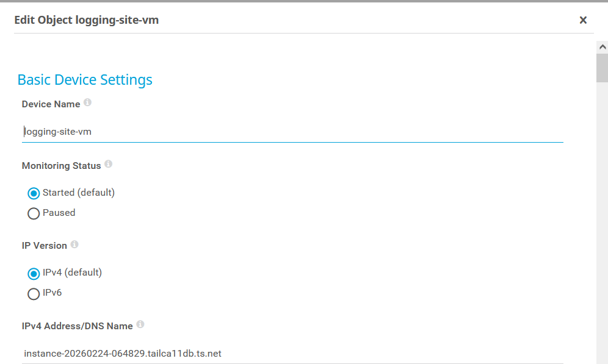
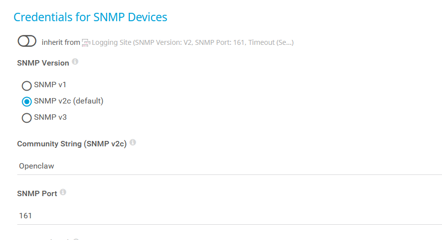
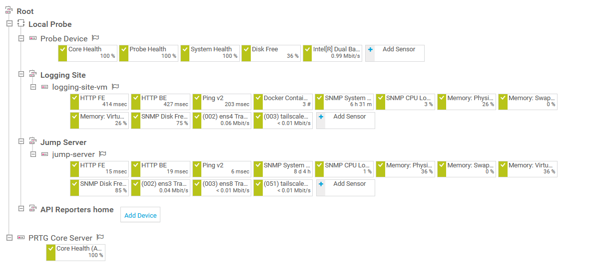
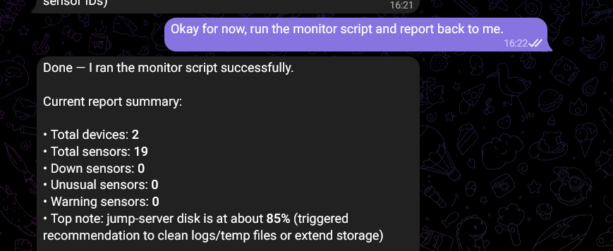

**Monitor hệ thống Linux sử dụng SNMP**

SNMP là một giao thức tầng Application của TCP/IP dành cho việc monitor và quản lý các thiết bị network như router, switch, server. Giao thức cho phép người dùng giám sát những thông số hiệu năng như uptime, CPU, memory, disk free, băng thông.

Để sử dụng SNMP, thiết bị host PRTG cần nằm trong cùng network với thiết bị cần monitor. Để giám sát thiết bị từ xa, có thể sử dụng Tailscale để setup VPN giữa các thiết bị.

Sau khi tạo tài khoản và setup Tailscale theo hướng dẫn của Tailscale thành công, các thiết bị sẽ được kết nối với nhau trong một network ảo, được cấp địa chỉ IP trong dải 100.64.0.0/10 của Tailscale:



Ngoài địa chỉ IPv4 và IPv6, Tailscale còn có dịch vụ DNS, cung cấp SSL và URL cho các thiết bị.



PRTG có thể giao tiếp với các địa chỉ thông qua những địa chỉ này. Ví dụ:



Note: Nên đổi những địa chỉ IP trong các sensor HTTP sang địa chỉ DNS để sensor có thể tiếp tục monitor trong trường hợp khởi động lại hệ thống.

Để kiểm tra xem các hệ thống đã liên kết với nhau hay chưa, thực hiện ping tới địa chỉ IP hoặc DNS.

SNMP hoạt động ở cổng UDP 161 và 162, cần mở 2 cổng này trong setting của firewall. Nếu hệ thống Linux chưa cài đặt SNMP: sudo apt install -y snmpd. Sau khi cài đặt, thực hiện edit config SNMP trong file /etc/snmp/snmpd.conf (cần sử dụng sudo để edit file này) và thêm/sửa những dòng sau:

```
sysLocation    "GCP VM"
sysContact     "Duy"
agentAddress udp:161
rocommunity Openclaw 100.64.0.0/10
rocommunity Openclaw 127.0.0.1
```

- sysLocation và sysContact là tên địa chỉ của máy linux, đặt theo ý muốn.

- agentAddress trỏ SNMP agent tới cổng nhận request.

- rocommunity là read only community string, đánh dấu đoạn dải địa chỉ có khả năng đọc dữ liệu SNMP từ hệ thống linux. Openclaw ở đây là đoạn password tự đặt, SNMP manager phải sử dụng đoạn password này để kết nối. Dải địa chỉ IP kia là dải CGNAT của Tailscale, cho phép mọi thiết bị trong network Tailscale kết nối SNMP với hệ thống.

Thực hiện restart snmp:

```
sudo systemctl restart snmpd
sudo systemctl enable snmpd
```

Sau đó chỉnh sửa UFW:
```
sudo ufw status
sudo ufw allow from 100.64.0.0/10 to any port 161 proto udp
```

Để kiểm tra xem SNMP đã được config đúng chưa, chạy lệnh:

```
snmpwalk -v2c -c Openclaw 127.0.0.1 1.3.6.1.2.1.1
```
Để test địa chỉ loopback, và

```
snmpwalk -v2c -c Openclaw 100.119.157.44 1.3.6.1.2.1.1
```

Để test địa chỉ do Tailscale cung cấp (thay thế IP bằng địa chỉ của chính hệ thống đó do Tailscale cấp)

Nếu cả 2 lệnh có output => Thành công.

Ở PRTG monitor, vào setting của device và update community string:



Sau đó thực hiện thêm các sensor. Những sensor chính và quan trọng là uptime, CPU, memory, disk free và traffic:



- Đối với sensor disk free, nên trỏ sensor vào directory parent /.

- Đối với sensor traffic, nên monitor NIC chính (eth0 hoặc ens) và tailscale.

Những sensor SNMP này hoạt động nhanh, chính xác và nhẹ nhàng hơn các SSH sensor.

**Lấy dữ liệu từ các sensor cho Openclaw**

Để lấy được dữ liệu từ các sensor để Openclaw có thể giám sát và phân tích, cần sử dụng API do PRTG cung cấp. 

PRTG triển khai authenticate cho API sử dụng user account. Tài khoản admin có thể tạo các tài khoản con với quyền hạn khác nhau và phân vào các nhóm user khác nhau. Từ đó admin có thể config quyền hạn cho từng group và device khác nhau.

Để tạo user account, vào Setup -> User Interface -> User Account. Tạo một account mới, thêm vào một group read-only. Tại group cần gửi data qua API, vào setting -> Access Rights, chọn group của account con và chọn Read.

Đăng nhập vào tài khoản con và truy cập URL:

```
https://<PRTG_HOST>/api/getpasshash.htm?username=<USERNAME>&password=<PASSWORD>
```

Để lấy passphrase. Sau khi có passphrase, sử dụng để truy cập các API của PRTG. Ví dụ: API lấy dữ liệu của các sensor:

```
https://<PRTG_HOST>/api/table.json?content=sensors&columns=objid,device,sensor,status,lastvalue&username=<USERNAME>&passhash=<PASSHASH>
```

Device:

```
/api/table.json?content=devices&columns=objid,group,device,status,host&username=...&passhash=...
```

Một sensor riêng biệt:

```
/api/getsensordetails.json?id=<SENSOR_ID>&username=...&passhash=...
```

Để hệ thống chạy Openclaw có thể gọi API và sắp xếp dữ liệu, có thể sử dụng script bash hoặc python. (Script sử dụng được chứa trong file prtg-daily-report.py). Để openclaw có thể auto chạy script này, có thể tạo 1 bash script khác để cấp biến và chạy script python:

```
#!/usr/bin/env bash
set -euo pipefail

# PRTG API config
export PRTG_URL="https://100.102.202.43"
export PRTG_USER="<username>"
export PRTG_PASSHASH="<pashhass>"
# Set to false for self-signed certs
export PRTG_VERIFY_TLS="false"

SCRIPT_DIR="$(cd "$(dirname "${BASH_SOURCE[0]}")" && pwd)"
PY_SCRIPT="$SCRIPT_DIR/prtg_daily_report.py"

if [[ ! -f "$PY_SCRIPT" ]]; then
  echo "Error: $PY_SCRIPT not found"
  exit 1
fi

if ! command -v python3 >/dev/null 2>&1; then
  echo "Error: python3 is not installed"
  exit 1
fi

exec python3 "$PY_SCRIPT"
```

Ví dụ output của script:

```
PRTG Daily Report (2026-04-01 08:57:12)

- Total devices: 2
- Total sensors: 24

Total devices by group:
  - Logging Site: 1
  - Jump Server: 1

Top CPU sensors:
  - logging-site-vm / SNMP CPU Load: 3.0
  - jump-server / SNMP CPU Load: 1.0

Top RAM sensors:
  - jump-server / Memory: Virtual memory: 35.7026
  - jump-server / Memory: Physical memory: 35.6673
  - logging-site-vm / Memory: Virtual memory: 25.6198
  - logging-site-vm / Memory: Physical memory: 25.5769
  - logging-site-vm / Memory: Swap space: 0.0

Top Disk sensors (by used %):
  - logging-site-vm / SNMP Disk Free v2 /: used 24.52% (free 75.48%)
  - jump-server / SNMP Disk Free v2 /: used 14.98% (free 85.02%)

Top Bandwidth sensors (Kbit/s and Mbit/s):
  - logging-site-vm / (002) ens4 Traffic: 442.21 Kbit/s (0.442 Mbit/s)
  - jump-server / (002) ens3 Traffic: 418.14 Kbit/s (0.418 Mbit/s)
  - logging-site-vm / (003) tailscale0 Traffic: 16.84 Kbit/s (0.017 Mbit/s)
  - jump-server / (051) tailscale0 Traffic: 9.98 Kbit/s (0.010 Mbit/s)
  - jump-server / (003) ens8 Traffic: 2.65 Kbit/s (0.003 Mbit/s)

Sensors in Down/Unusual/Warning states:
  - Down: 0
  - Unusual: 0
  - Warning: 0
  - No unusual sensors today

Recommendations:
  - No critical anomalies detected today. Keep current thresholds and monitor trends.
```

Script phân tích và output các sensor của PRTG. Openclaw có thể chạy script này để lấy dữ liệu và phân tích.



Có thể setup cron để Openclaw chạy script này 5 phút 1 lần để phân tích hoạt động trong một khoảng thời gian dài hơn.


