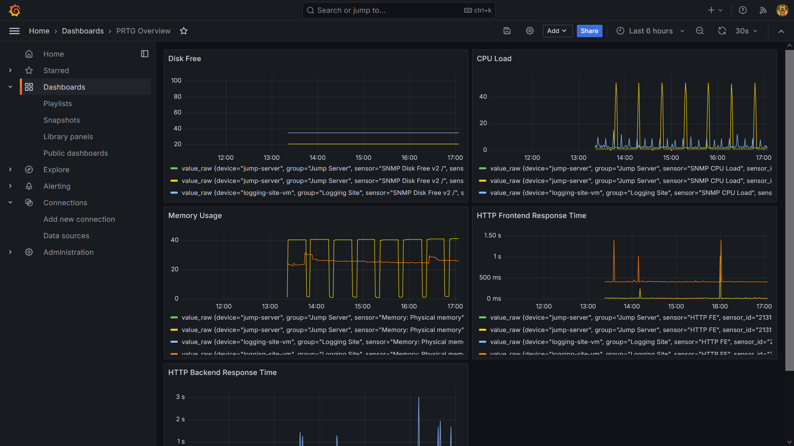
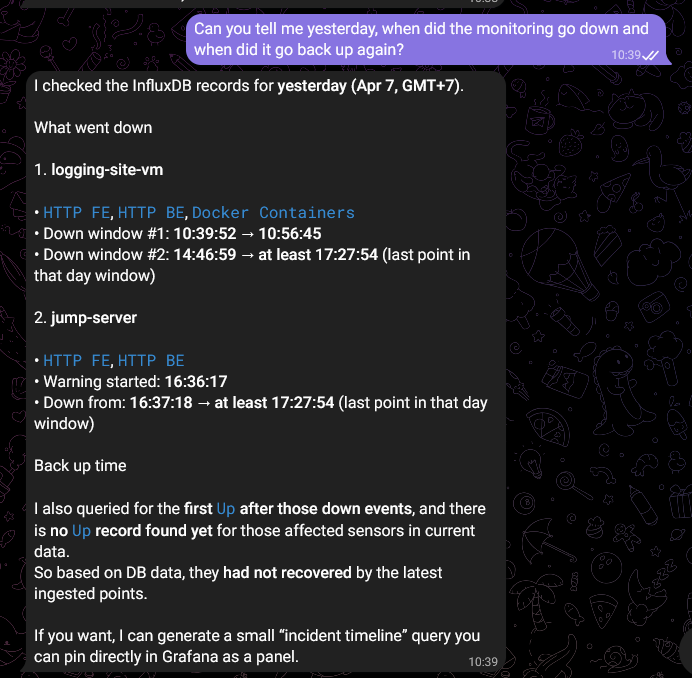
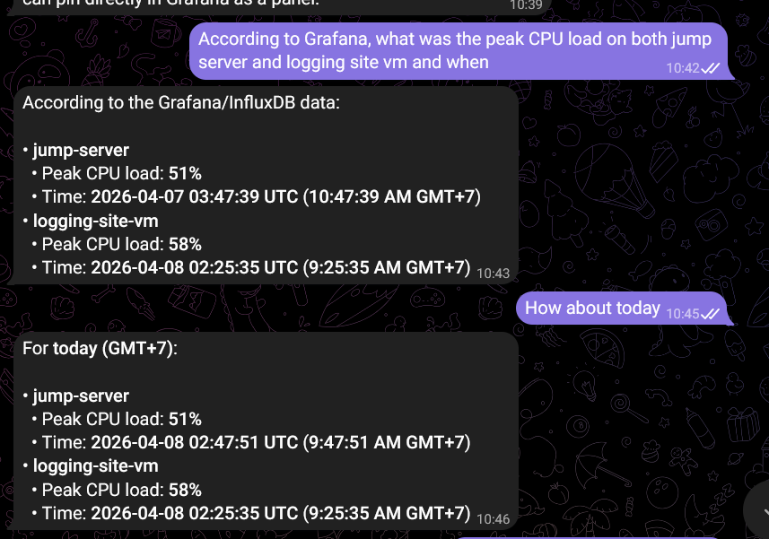
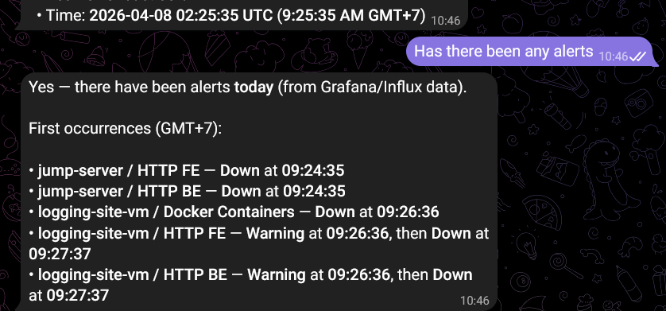

**Sử dụng một dịch vụ tạo Dashboard như Grafana**

Grafana là một nền tảng giám sát và visualization hệ thống.

Grafana có thể nhận data sensor qua API của PRTG và giúp xây dựng các mô hình, bảng, biểu đổ phân tích các dữ liệu đó trong real-time. Grafana có thể phát hiện sự cố khi thông số chạm threshold và thông báo với người dùng hoặc Openclaw bằng alert. Grafana có khả năng kết nối với DB để lưu trữ dữ liệu và xây dựng biểu đồ qua một khoảng thời gian dài, DB thường dùng nhất là InfluxDB.

Grafana được cấu thành từ một vài thành phần chính:

- Nguồn dữ liệu: Grafana có thể kết nối tới những hệ thống khác nhau để lấy dữ liệu như Elasticsearch (logging), InfluxDB (lưu dữ liệu và time-series) hay như trong ứng dụng lần này là lấy data qua API của PRTG.

- Dashboard: là nơi hiển thị dữ liệu chính, gồm nhiều panel có thể tùy chỉnh bố cục linh hoạt. Người dùng có thể tạo nhiều dashboard khác nhau để phục vụ các use case khác nhau. 

- Panel: là các ô chứa biểu đồ. Có thể điều chỉnh data source và query khác nhau giữa các biểu đồ. Các loại biểu đồ có thể sử dụng: đường, cột, bảng, đồng hồ, heatmap...

- Query: dùng để lấy dữ liệu từ data source. Mỗi panel có 1 hoặc nhiều query. Trong ứng dụng lần này sử dụng ngôn ngữ Flux để query InfluxDB.

- Alert: tại các panel, người dùng có thể configure các ngưỡng cảnh báo. Khi data đạt tới các ngưỡng này, Grafana có thể gửi cảnh báo tới người dùng hoặc Openclaw.

**Chạy Grafana**

Grafana là một hệ thống mã nguồn mở, cách tốt nhất để triển khai cho ứng dụng này là deploy InfluxDB và Grafana trong docker container, tạo một script collector để lấy dữ liệu từ API PRTG và chạy cả 3 sử dụng compose.

Để dễ dàng chạy stack Grafana này, nên có một file .env chung cho collector và InfluxDB:

```
PRTG_URL=https://100.102.202.43 #URL của API PRTG
PRTG_USER=<username PRTG dùng để auth API>
PRTG_PASSHASH=<passhash>
PRTG_VERIFY_TLS=false

# InfluxDB init
DOCKER_INFLUXDB_INIT_MODE=setup
DOCKER_INFLUXDB_INIT_USERNAME=admin #username để khởi tạo InfluxDB
DOCKER_INFLUXDB_INIT_PASSWORD=<password để khởi tạo InfluxDB>
DOCKER_INFLUXDB_INIT_ORG=<tên org, cần phải match với tên org trong collector và setup Grafana về sau>
DOCKER_INFLUXDB_INIT_BUCKET=<tên bucket, cần match với collector>
DOCKER_INFLUXDB_INIT_ADMIN_TOKEN=<token, cần match với collector>

# Collector
INFLUX_URL=http://influxdb:8086 #URL của db
INFLUX_ORG=<tên org, trùng với db>
INFLUX_BUCKET=<tên bucket, trùng với db>
INFLUX_TOKEN=change_me_influx_token <token, trùng với db>
```

.env sẽ chứa các biến cần để khởi tạo và chạy các container, giúp người dùng dễ dàng kiểm soát các biến này.

Collector: cần một script để có thể call và lấy dữ liệu từ API. Script sử dụng trong ứng dụng lần này là prtg-to-influx.py. Chu kì call là 60 giây 1 lần, script sẽ call và viết dữ liệu vào InfluxDB để Grafana có thể đọc.

Để chạy đồng nhất script, db và Grafana, cần sử dụng compose.

```
services:
  influxdb:
    image: influxdb:2.7
    container_name: prtg-influxdb
    env_file: .env
    ports:
      - "8086:8086"
    volumes:
      - ./data/influxdb:/var/lib/influxdb2
    restart: unless-stopped

  grafana:
    image: grafana/grafana:11.0.0
    container_name: prtg-grafana
    ports:
      - "3001:3000"
    depends_on:
      - influxdb
    volumes:
      - ./data/grafana:/var/lib/grafana
    restart: unless-stopped

  prtg-collector:
    image: python:3.11-slim
    container_name: prtg-collector
    working_dir: /app
    env_file: .env
    depends_on:
      - influxdb
    volumes:
      - ./collector:/app
    command: >
      sh -c "pip install --no-cache-dir requests influxdb-client &&
             python /app/prtg_to_influx.py"
    restart: unless-stopped
```

Dữ liệu của Grafana và DB được lưu lại trong các thư mục trong hệ thống để Openclaw có thể đọc, phân tích và thông báo với người dùng.

Sau khi chạy compose, người dùng có thể truy cập grafana qua port đã định trong file yml ở địa chỉ IP public và đăng nhập (username và password default là admin và admin).

Note: Nếu cần reset password, chạy command sau:

```
docker exec -it <container_name> grafana-cli admin reset-admin-password <new_password>
```

Sau khi đăng nhập, cần kết nối với data source là InfluxDB. Connections -> Data sources -> Chọn InfluxDb. Nhập URL, tên db, user, password trong file .env và chọn Save & Test. Hệ thống sẽ báo xanh nếu kết nối thành công.

Sau đó, để tạo dashboard, vào mục dashboard và new dashboard. Tại đây người dùng có thể import dashboard từ file json hoặc tự tạo visualization. Trong ứng dụng này sẽ chọn phương án 2. Người dùng sẽ tạo một panel đầu tiên. Để tạo panel, có 2 bước cơ bản là set query và chọn loại biểu đồ. Ngôn ngữ chính để query InfluxDB là Flux.

```
from(bucket: "prtg")
|> range(start: v.timeRangeStart, stop: v.timeRangeStop)
|> filter(fn: (r) => r._measurement == "prtg_sensor")
|> filter(fn: (r) => r.sensor == "SNMP CPU Load")
|> filter(fn: (r) => r._field == "value_raw")
```

Ví dụ query là dữ liệu về CPU load.

Người dùng có thể chọn nhiều biểu đồ khác nhau nhưng hữu ích nhất cho ứng dụng này là time chart để theo dõi dữ liệu qua thời gian.



Tại dashboard, có thể điều chỉnh thời gian hiển thị từ 1h trước tới kích cỡ năm. Ở các panel, có thể điều chỉnh nhiều thông số customize như đơn vị, threshold...

Sau khi có dữ liệu từ Grafana và InfluxDB, người dùng có thể yêu cầu Openclaw phân tích các dữ liệu đó, thông báo với người dùng khi nào xảy ra sự cố như sau:







**Alert trong Grafana**

Grafana có thể gửi alert tới người dùng khi thông số đạt tới một ngưỡng nào đó thông qua nhiều kênh khác nhau.

- Grafana alert thỉnh thoảng sẽ query dữ liệu từ data source và đánh giá chúng dựa theo điều kiện trong alert rule.

- Nếu vượt ngưỡng cho phép => alert instance.

- Alert instance sẽ được điều hướng tới các notification policy khác nhau tùy vào lable của alert đó.

- Notification sẽ được gửi tới các contact point khác nhau.

Cũng giống như các panel trong dashboard, alert của Grafana cũng sử dụng query để lấy dữ liệu từ data source.