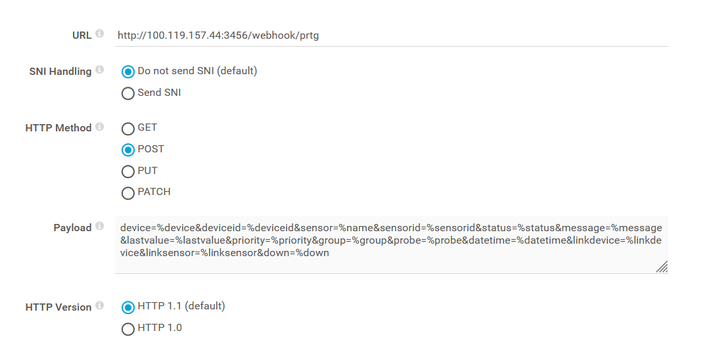
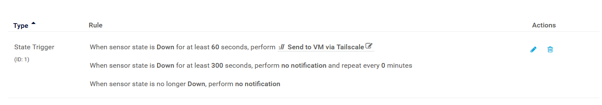
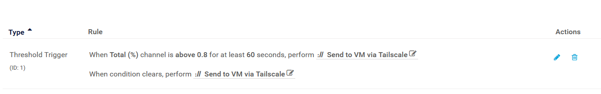
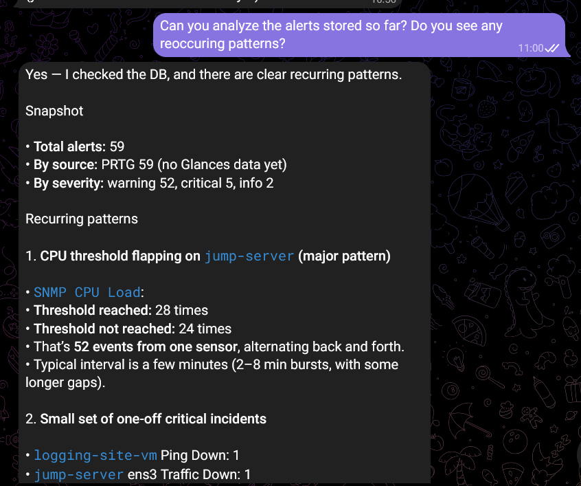
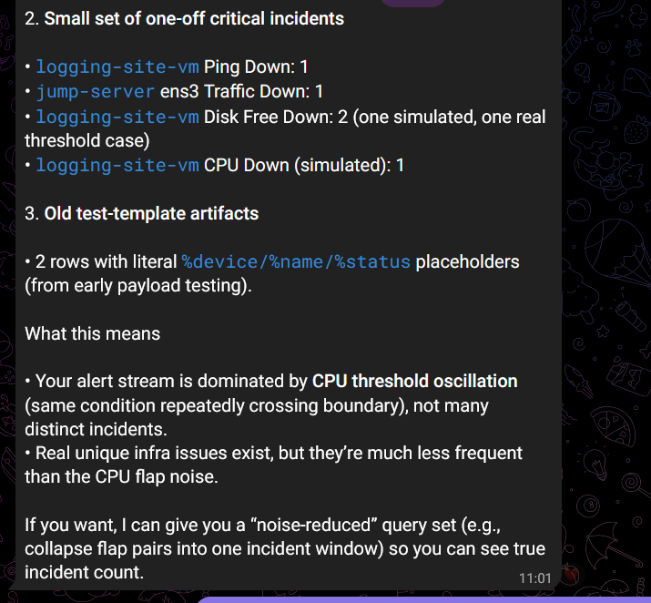
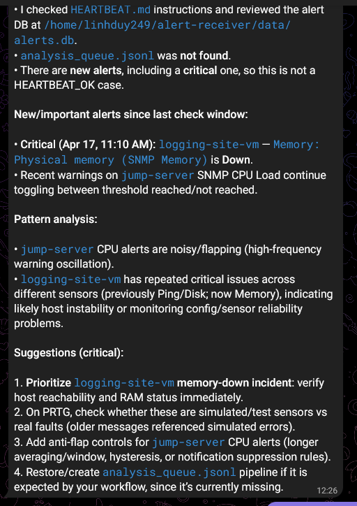

**PRTG Alerts**

Có một vài loại alert khác nhau trong PRTG:

- Alert trong sensor: có sẵn trong sensor. Trigger tự động khi đạt điều kiện như timeout, lỗi socket, probe mất kết nối.

- Alert threshold: Người dùng có thể set giới hạn cảnh báo và error trong từng channel. 

- Alert khi data thay đổi: gửi alert khi sensor detect data thay đổi.

Hệ thống notification: khi bắn alert, PRTG có thể gửi qua nhiều kênh khác nhau như email, sms, HTTP request (webhook), SNMP traps, Slack/Teams, scripts...

Trong ứng dụng lần này, alert PRTG có thể gửi qua HTTP API sử dụng hệ thống notification của PRTG.

Setup -> Account Settings -> Notifications Templates. Tại đây có thể tạo template cho notification, config setting chung cho notification cần sử dụng. Riêng trong ứng dụng này, cần configure HTTP action trong notification template.



- URL: địa chỉ để PRTG gửi notification tới. Tại máy đang chạy OpenClaw có setup một webserver chạy một API cho phép PRTG gửi alert tới và webserver sẽ lưu lại vào DB.

- Payload: là nội dung của alert cần gửi. Payload cần phải theo dạng form, ko sử dụng dạng json hay xml.

- HTTP method: POST do PRTG sẽ làm nhiệm vụ gửi alert đi.

Sau khi tạo template thành công, có thể configure notification cho các device và sensor trong PRTG.

Có 5 cách alert có thể trigger:

- State trigger: gửi alert khi sensor down.

- Speed trigger: gửi alert khi tốc độ data đạt ngưỡng.

- Volume trigger: gửi alert khi kích cỡ đạt ngưỡng.

- Threshold trigger: trigger chung hơn, gửi alert khi đạt ngưỡng nào đó.

- Change trigger: gửi alert khi có thay đổi nhất định trong data.

Tại mức device, nên tạo state trigger để báo hiệu khi có sensor down.



Có thể cài đặt các trigger cụ thể cho các sensor. Ví dụ như trong sensor CPU load, có thể cài đặt threshold trigger khi CPU load quá 80%



Một số alert hữu dụng khác là alert khi disk free còn quá ít, load memory cao trong thời gian dài.

Khi có alert, PRTG sẽ gửi POST request tới receiver trong hệ thống chạy Openclaw. Webserver chạy receiver này nằm trong file server.js:

- Script tạo database sqlite để chứa alert nhận từ nhiều kênh khác nhau. Các alert từ các kênh khác nhau đều đc chứa trong cùng 1 bảng để Openclaw có thể dễ dàng phân tích theo dòng thời gian.

- Có nhiều API để các kênh có thể gửi alert riêng tới receiver.

- Server sẽ nhận alert từ các kênh, thực hiện xử lý dữ liệu để lưu vào DB. Dữ liệu sau khi xử lý sẽ đc lưu như sau

```
  {
    "id": 56,
    "source": "prtg",
    "device": "jump-server",
    "device_id": "2129",
    "sensor": "SNMP CPU Load (SNMP CPU Load)",
    "sensor_id": "2148",
    "status": "Threshold reached (Total)",
    "severity": "warning",
    "message": "OK",
    "last_value": "1 %",
    "priority": "***",
    "group_name": "Jump Server",
    "probe": "Local Probe",
    "down_time": "(<1 %)",
    "device_url": "https://DuyTL-TTS.mshome.net/device.htm?id=2129",
    "sensor_url": "https://DuyTL-TTS.mshome.net/sensor.htm?id=2148",
    "timestamp": "4/16/2026 4:34:18 PM",
    "raw": "{\"device\":\"jump-server\",\"deviceid\":\"2129\",\"sensor\":\"SNMP CPU Load (SNMP CPU Load)\",\"sensorid\":\"2148\",\"status\":\"Threshold reached (Total)\",\"message\":\"OK\",\"lastvalue\":\"1 %\",\"priority\":\"***\",\"group\":\"Jump Server\",\"probe\":\"Local Probe\",\"datetime\":\"4/16/2026 4:34:18 PM\",\"linkdevice\":\"https://DuyTL-TTS.mshome.net/device.htm?id=2129\",\"linksensor\":\"https://DuyTL-TTS.mshome.net/sensor.htm?id=2148\",\"down\":\"(<1 %)\"}"
  }
```

Script sẽ lọc và lưu data vào các cột khác nhau, cũng như là lưu đoạn data raw do phía kênh gửi.

Sau khi có một lượng dữ liệu vừa phải, có thể yêu cầu Openclaw thực hiện phân tích dữ liệu, phát hiện các pattern và đưa ra phương án xử lý.





Nên configure việc check này thành một cron job để Openclaw có thể kiểm tra thường xuyên.



Note: nên chạy server trong docker container và compose để dễ dàng quản lý server. Khi chạy nên kiểm tra log thường xuyên:

```
docker compose logs
```

Server có API GET /alerts để get 20 dòng mới nhất trong DB, nên sử dụng để kiểm tra xem server có nhận đc alert hay ko

```
curl http://localhost:3456/alerts | jq
```

Trong PRTG, có thể kiểm tra logs để xem PRTG có gửi alert đi hay không.

Mục tiêu: setup các hệ thống monitor khác để nhận alert. Có thể display các alert ra front-end.

