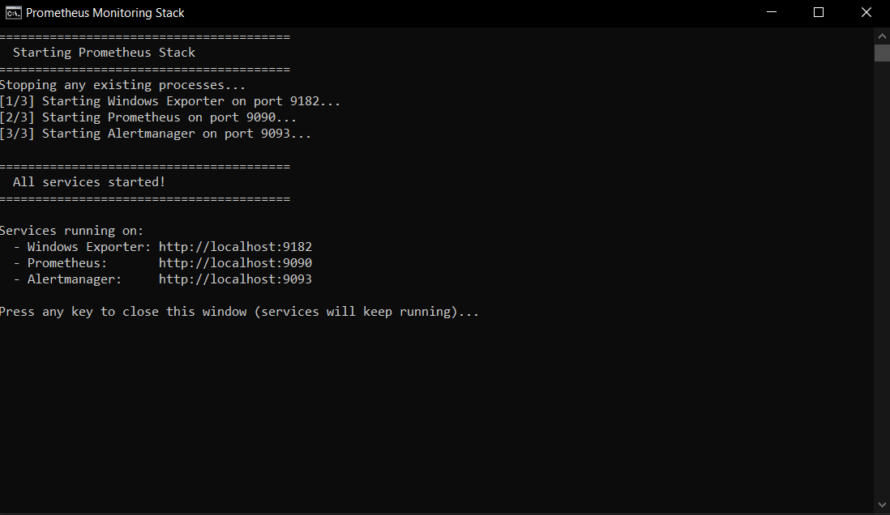
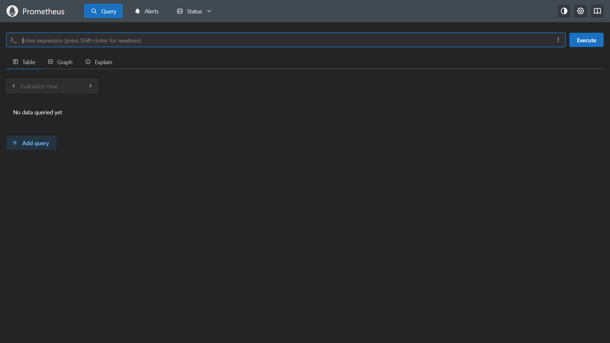
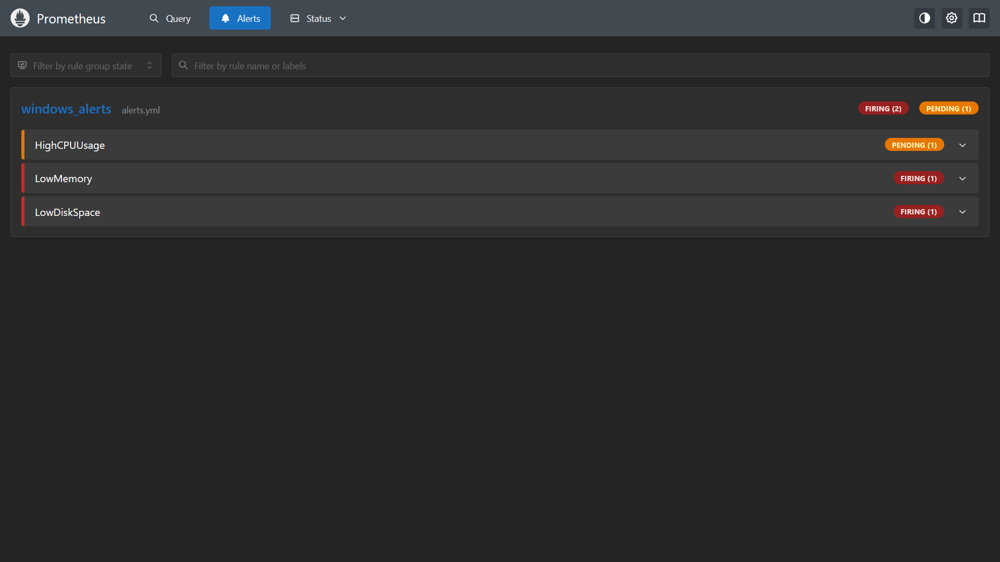
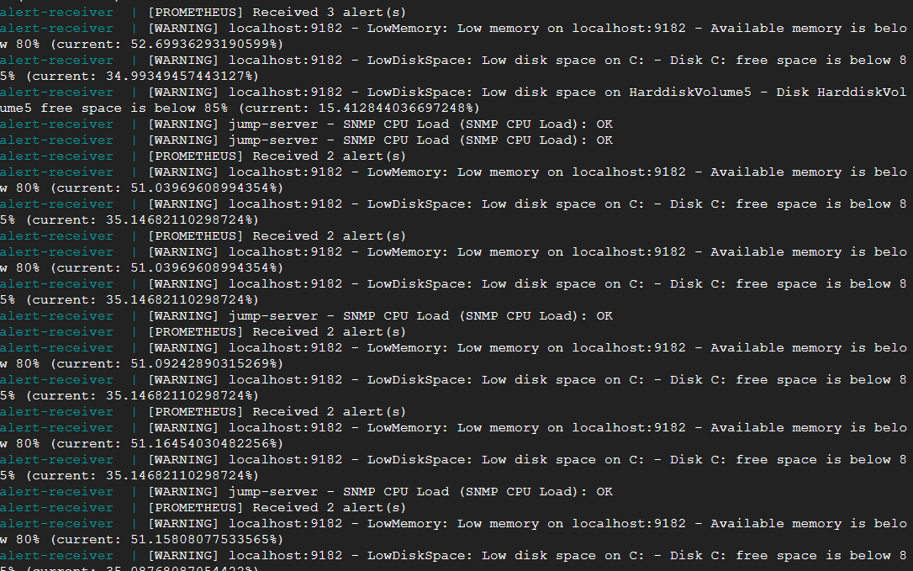

**Prometheus**

Prometheus là một phần mềm monitor mã nguồn mở được sử dụng phổ biến và rộng rãi nhất. Mục địch sử dụng Prometheus lần này là để monitor một thiết bị sử dụng windows.

**Setup Prometheus**

Có nhiều cách để cài đặt Promethus:

- Chạy binary đã compile: tải xuống file zip/tar, extract và chạy trực tiếp hoặc qua cmd/terminal (nên dùng cho windows)

- Tải từ package manager (nên dùng cho linux)

- Chạy trong docker/docker compose.

Config: sau khi cài đặt, cần tạo hoặc edit file config prometheus.yml:

Link: https://github.com/prometheus/prometheus

```
# my global config
global:
  scrape_interval: 15s # Set the scrape interval to every 15 seconds. Default is every 1 minute.
  evaluation_interval: 15s # Evaluate rules every 15 seconds. The default is every 1 minute.
  # scrape_timeout is set to the global default (10s).

# Alertmanager configuration
alerting:
  alertmanagers:
    - static_configs:
        - targets: ['localhost:9093']

# Load rules once and periodically evaluate them according to the global 'evaluation_interval'.
rule_files:
  # - "first_rules.yml"
  # - "second_rules.yml"
  - 'alerts.yml'

# A scrape configuration containing exactly one endpoint to scrape:
# Here it's Prometheus itself.
scrape_configs:
  # The job name is added as a label `job=<job_name>` to any timeseries scraped from this config.
  - job_name: "prometheus"

    # metrics_path defaults to '/metrics'
    # scheme defaults to 'http'.

    static_configs:
      - targets: ["localhost:9090"]
       # The label name is added as a label `label_name=<label_value>` to any timeseries scraped from this config.
        labels:
          app: "prometheus"

  - job_name: 'windows'
    static_configs:
      - targets: ['localhost:9182']
```

- alertmanager là một program được phát triển cho prometheus để gửi alert của prometheus tới webhook của VM chạy Openclaw. Trong prometheus.yml, cần config port cho alertmanager.

- rule_files: trỏ tới file config alert.

- job_name: trỏ prometheus tới data source. Để monitor máy windows, cần một program được phát triển riêng khác là windows_exporter để lấy dữ liệu của hệ thống.

windows_exporter: https://github.com/prometheus-community/windows_exporter. Thực hiện lấy dữ liệu hệ thống của máy và là một data source cho prometheus.

Cách sử dụng: tải về và chạy trực tiếp hoặc qua cmd. Default thì exporter sẽ chạy ở port 9182 và cần phải chỉ rõ port trong config của prometheus để nó có thể đọc data source.

alertmanager: https://github.com/prometheus/alertmanager. Thực hiện gửi alerts của Prometheus tới webhook. Để chạy, tải về và chạy trực tiếp hoặc qua cmd. Cần setup file config cho alertmanager:

```
route:
  receiver: 'alert-receiver'
  group_by: []
  group_wait: 1s
  group_interval: 5s
  repeat_interval: 5m

receivers:
  - name: 'alert-receiver'
    webhook_configs:
      - url: 'http://100.119.157.44:3456/webhook/prometheus'
        send_resolved: true

inhibit_rules:
  - source_matchers: [severity="critical"]
    target_matchers: [severity="warning"]
    # Apply inhibition if the alertname is the same.
    # CAUTION:
    #   If all label names listed in `equal` are missing
    #   from both the source and target alerts,
    #   the inhibition rule will apply!
    equal: [alertname, dev, instance]
```

- Quan trọng nhất ở đây là repeat_interval, là chu kì lặp lại việc gửi alert tới webhook.

Để tạo alert và notification cho prometheus, cần tạo một file alerts.yml cho prometheus:

```
groups:
  - name: windows_alerts
    rules:
      # CPU Alert - trigger when idle time is low (high usage)
      - alert: HighCPUUsage
        expr: 100 - (avg by (instance) (irate(windows_cpu_time_total{mode="idle"}[5m])) * 100) > 10
        for: 2m
        labels:
          severity: warning
        annotations:
          summary: "High CPU usage on {{ $labels.instance }}"
          description: "CPU usage is above 10% (current: {{ $value }}%)"

      # Memory Alert - low available memory
      - alert: LowMemory
        expr: (windows_memory_available_bytes / windows_memory_physical_total_bytes) * 100 < 80
        for: 1m
        labels:
          severity: warning
        annotations:
          summary: "Low memory on {{ $labels.instance }}"
          description: "Available memory is below 80% (current: {{ $value }}%)"

      # Disk Alert - low free space
      - alert: LowDiskSpace
        expr: (windows_logical_disk_free_bytes{volume="C:"} / windows_logical_disk_size_bytes{volume="C:"}) * 100 < 85
        for: 1m
        labels:
          severity: warning
        annotations:
          summary: "Low disk space on {{ $labels.volume }}"
          description: "Disk {{ $labels.volume }} free space is below 85% (current: {{ $value }}%)"
```

- Có 3 alert: CPU load, memory và diskfree, mỗi alert có query riêng, thời gian chờ (for), label và phần mô tả. (Các giá trị trong đây là placeholder để thực hiện testing)

Để dễ dàng chạy cả 3 program, nên tạo một file script (prometheus-startup.bat).



Để theo dõi hoạt động, có thể access Web UI ở các port tương ứng.

UI của Prometheus:



Trang query chính của Prometheus, có thể thực hiện query và view dữ liệu dưới dạng bảng hoặc sơ đồ.



Trang alert, có thể theo dõi ngưỡng và trạng thái gửi alert.

Sau khi setup thành công, cần update alert-receiver để có webhook để nhận alert (server2.js). Kiểm tra log của alert-receiver => đã nhận được alert:



**Query trong Prometheus**

Prometheus sử dụng ngôn ngữ query PromQL. Có 2 loại query chính:

- Instant query: giá trị tại thời điểm hiện tại. VD: up sẽ hiển thị trạng thái up của các job trong prometheus (job được định trong config)

- Range query: giá trị trong một khoảng thời gian nhất định. VD: rate(windows_cpu_time_total[5m])

Các thành phần tạo nên query:

- Metric name: có thể coi là tên biến cho các thông tin của data source, trong trường hợp này là thông tin về máy tính windows. VD: windows_memory_available_bytes là lượng memory còn dư tính bằng byte.

- Label filtering: các thành phần thêm vào để lọc thêm. VD: windows_logical_disk_free_bytes{volume="C:"} sẽ kiểm tra disk free ở ổ đĩa C

Các kí hiệu so sánh: = (giống) != (khác) =~ (match regex) !~ (không match regex)

- Function: các hàm tính toán. Một số hàm phổ biến:

    - rate()/irate(): tính rate. VD: rate(windows_net_bytes_received_total[5m]): tính toán byte per second của đầu vào network interface trong 5 phút trước.

    - increase(): tính tổng . VD: increase(windows_net_bytes_received_total[1h]): tổng lượng data network interface đã nhận trong 1h trước.

    - avg_over_time(), max_over_time(): tính trung bình hoặc max trong một khoảng thời gian.

    - sum, avg, max, min.

Các query chính được sử dụng cho alert

CPU load:
```
100 - (avg by (instance) (irate(windows_cpu_time_total{mode="idle"}[5m])) * 100) > 10
```

- window_cpu_time_total: tổng thời gian CPU đã chạy ở từng instance (đối với CPU, một instance là một core hay thread)

- {mode="idle"}: chỉ lấy thời gian CPU ở trạng thái idle

- irate(...[5m]): tính tốc độ tăng tức thời trong 5 phút trước

- avg by (instance): lấy trung bình của tất cả các core

- 100 - (... * 100): đổi sang % và lấy thời gian non-idle.

Memory:

```
(windows_memory_available_bytes / windows_memory_physical_total_bytes) * 100 < 80
```

- windows_memory_available_bytes: dung lượng RAM còn available

- windows_memory_physical_total_bytes: tổng dung lượng RAM vật lý.

=> tính % RAM còn trống

Disk free (ổ C):

```
(windows_logical_disk_free_bytes{volume="C:"} / windows_logical_disk_size_bytes{volume="C:"}) * 100 < 85
```

- windows_logical_disk_free_bytes{volume="C:"}: số byte còn trống của ổ C

- windows_logical_disk_size_bytes{volume="C:"}: tổng dung lượng của ổ C

=> tính disk free.

Sau khi setup alert-receiver thành công, có thể tạo một web page để hiển thị các alert đã nhận đc để dễ dàng theo dõi.